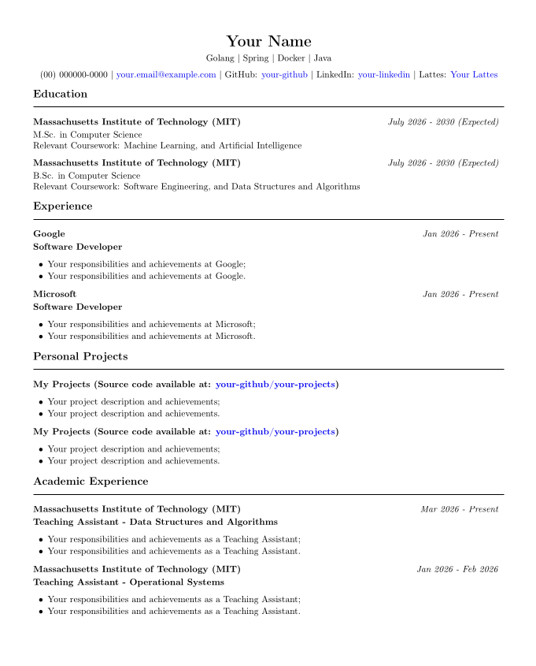

# Resume Generator

A flexible and extensible resume generator that produces professional resumes from structured YAML data. The project supports multiple output formats, allowing the same resume information to be rendered as both **HTML** and **LaTeX/PDF**, making it suitable for web viewing, printing, and academic or professional applications.

<p align="center">
  
</p>

---

## Features

* Generate resumes from a single YAML file.
* HTML resume generation using templates.
* LaTeX resume generation for high-quality PDF output.
* Easy customization through HTML templates and CSS.
* Separation between data, rendering, and generation logic.
* Lightweight architecture with minimal dependencies.
* Suitable for creating multiple resume themes.

---

## Project Structure

```text
.
├── latex
│   ├── curriculum.pdf
│   ├── curriculum.tex
│   └── Makefile
├── LICENSE
└── python
    ├── requirements.txt
    └── src
        ├── data
        │   └── resume-example.yml
        ├── generator
        │   ├── generator.py
        │   ├── parser.py
        │   └── renderer.py
        ├── main.py
        ├── output
        │   └── index.html
        ├── static
        │   └── style.css
        └── templates
            └── basic.html
```

---

# Requirements

* Python
* pip
* LaTeX distribution

Recommended LaTeX distributions:

* TeX Live (Linux)
* MiKTeX (Windows)
* MacTeX (macOS)

---

# Installation

Clone the repository:

```bash
git clone https://github.com/jose-s-melo/resume-generator.git

cd resume-generator
```

Install Python dependencies:

```bash
cd python

pip install -r requirements.txt
```

---

# Usage

## Python

### 1. Create a Resume

Create a YAML file describing your resume.

Example:

```yaml
personal:
  name: John Doe
  email: john@example.com

education:
  - degree: Computer Science
    institution: Example University

experience:
  - company: Example Inc.
    role: Software Engineer
```

---

### 2. Run the Generator

```bash
cd python/src

python main.py
```

The generated HTML will be available in:

```
output/index.html
```

---

## LaTeX

Navigate to the LaTeX directory.

```bash
cd latex
```

Edit `curriculum.tex` file with your informations.

Compile using:

```bash
make
```

or

```bash
pdflatex curriculum.tex
```

The resulting PDF will be generated as:

```
curriculum.pdf
```

For clean the directory run:

```bash
make clean
```
